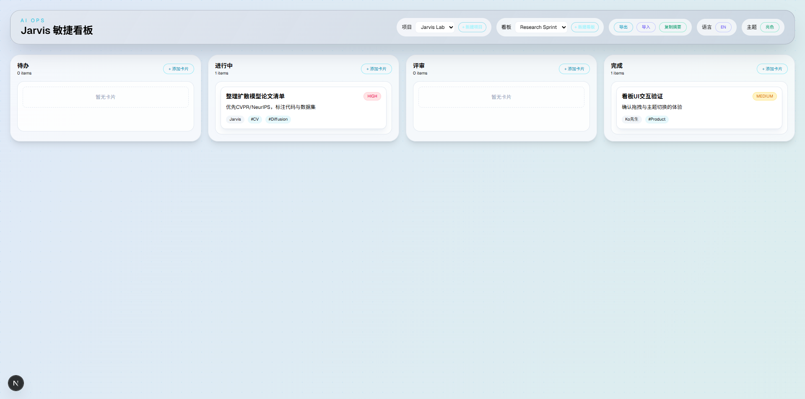
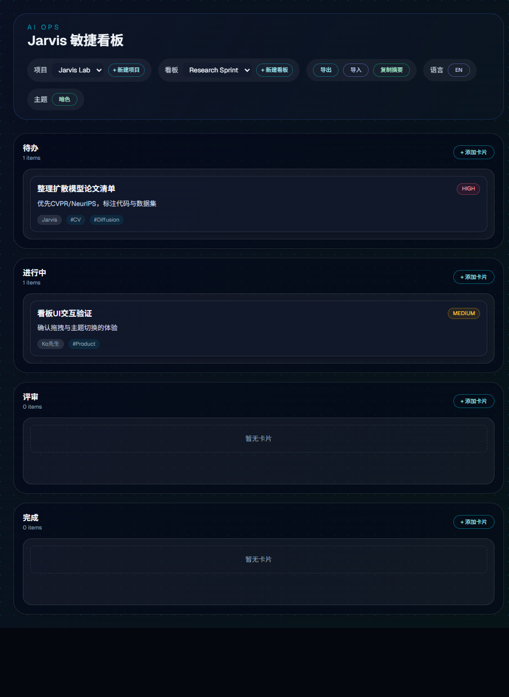

# Jarvis Kanban Panel

Jarvis Kanban 是一个轻量的本地看板，用于个人研究/项目管理，支持拖拽、主题切换、数据导入导出与摘要复制。

## 功能特性

- 项目 + 多看板切换
- 拖拽排序与跨列移动
- 主题切换（暗色 / 亮色）
- 中英双语界面
- 卡片编辑（负责人/优先级/标签/截止日期）
- **导出 JSON 备份**
- **导入 JSON 恢复**
- **复制摘要到剪贴板**（便于日报/周报）
- **快速添加任务**（输入标题即可入列）
- **WIP 上限提示**（列容量预警）
- **专注模式**（隐藏 Done 列）

## 开始使用

```bash
npm install
npm run dev
```

浏览器打开 <http://localhost:3000>。

## 数据导入/导出

- **导出**：右上角点击“导出”，会生成 `jarvis-kanban-*.json` 文件。
- **导入**：点击“导入”选择之前导出的 JSON 文件。
- **复制摘要**：点击“复制摘要”，会把当前项目/看板摘要写入剪贴板。

> 导入会覆盖当前状态（项目/看板/主题/语言）。

## 协作增强

- **快速添加**：在顶部快速栏输入标题、负责人和优先级，一键入列。
- **WIP 上限**：每列可设置容量上限，超出会高亮提醒。
- **专注模式**：一键隐藏 Done 列，聚焦进行中任务。

## Sync Bridge（文件同步）

- 在支持 **File System Access API** 的浏览器中使用（如 Chrome / Edge），不支持时会显示提示并禁用按钮。
- 点击“连接文件”选择或创建 `jarvis-kanban-sync.json`。
- 点击“立即同步”写入当前状态；**自动同步可开关**，开启后每次变更会在 500ms 内写入。
- “断开”仅清除内存中的连接句柄，刷新页面后需要重新连接。
- “复制同步路径”会复制浏览器提供的文件名（出于安全限制无法读取完整路径）。

## Local Sync Agent（自动读取）

让 Jarvis 自动读取同步文件，生成机器可读快照和摘要。

**Windows（PowerShell）**
```bash
set SYNC_FILE=C:\path\to\jarvis-kanban-sync.json
npm run sync:watch
```

**macOS / Linux**
```bash
SYNC_FILE=/path/to/jarvis-kanban-sync.json npm run sync:watch
```

输出文件：
- `.sync/latest.json`（完整 JSON 快照）
- `.sync/summary.md`（可读摘要）

自动协作行为：
- 识别 @Jarvis 任务后自动标记“已读”并移入「进行中」
- 追加对话消息到面板（Conversation 区域）
- 若标签包含“完成/done/completed”，自动移入「评审」

## Jarvis 回复回写

我完成任务后，会通过 reply 队列回写到面板对话，并可自动移入评审：
```bash
node scripts/jarvis-reply.js --file <sync.json> --message "答复内容" --title "任务标题" --complete
```

> 只要本地 agent 在运行，Jarvis 就能直接读取这些输出文件。

## 一键启动（Windows）

双击运行：
```
C:\Users\Gary_\tmp\jarviskanban\scripts\jarvis-oneclick.cmd
```

它会弹出选择框，让你选同步文件，并自动启动（后台最小化）：
- 面板（npm run dev）
- 同步代理（npm run sync:watch）
- 浏览器页面

**生成桌面快捷方式（推荐）**
```powershell
powershell -NoProfile -ExecutionPolicy Bypass -File C:\Users\Gary_\tmp\jarviskanban\scripts\jarvis-make-shortcut.ps1
```

## 技术栈

- Next.js (App Router)
- React
- Tailwind CSS
- @dnd-kit (拖拽)

## 截图

### 亮色主题



### 暗色主题



## 备注

该项目是本地使用的个人工具，默认不包含后端/数据库。
